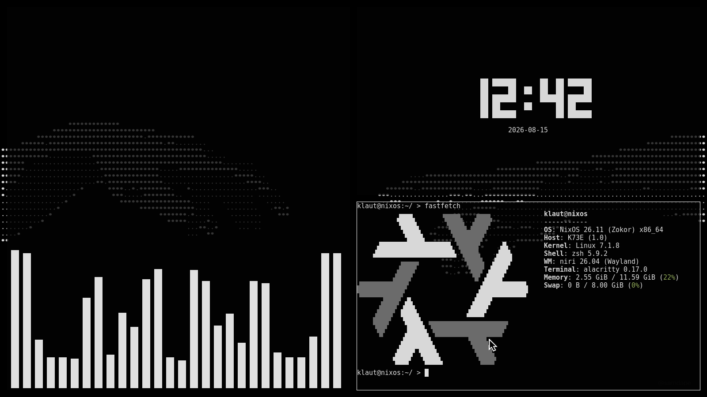
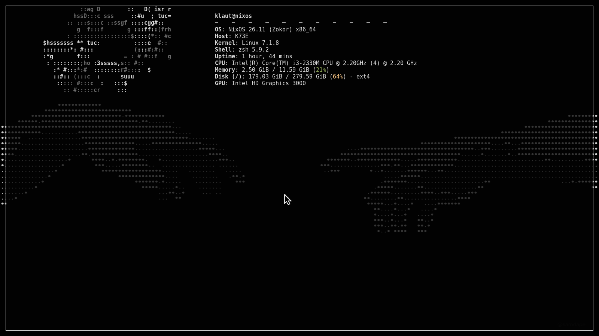
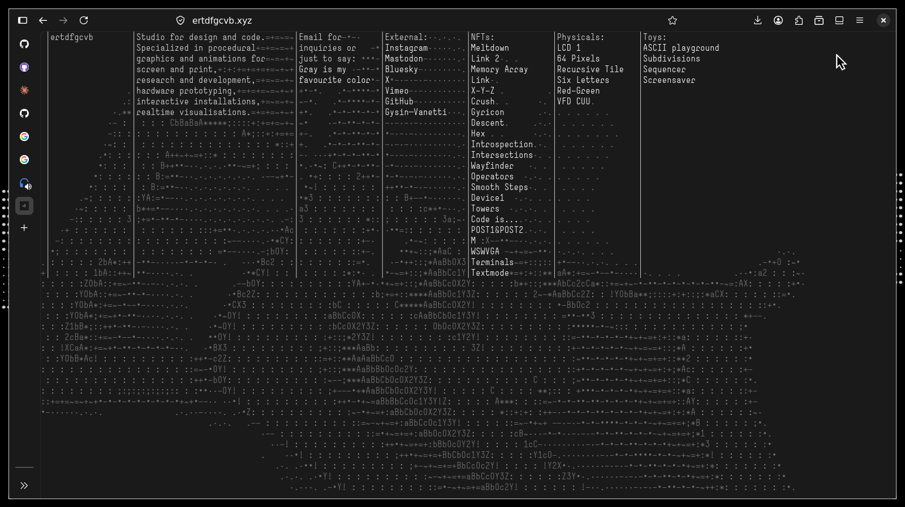
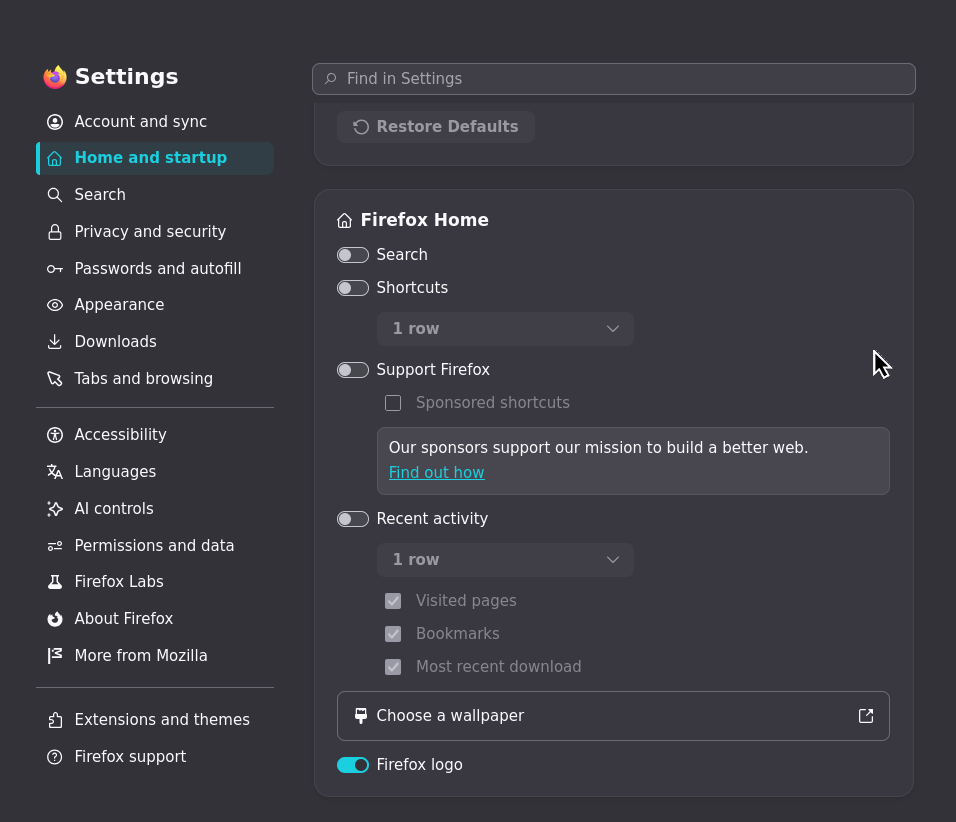

# niri creation of adam

A minimal black-and-white [niri](https://github.com/YaLTeR/niri).

| | | |
|---|---|---|
|  |  |  |

## Firefox settings
Change these parameters in firefox: off search, shortcuts and everything else like in the screenshot; horizontal tabs to vertical tabs; . Also change theme on this [nicedarktheme](https://addons.mozilla.org/en-US/firefox/addon/nicedarktheme/)
| | |
|---|---|
|  |  |

## What's inside

```

├── niri/config.kdl          niri window rules, gaps, focus ring, wallpaper
├── alacritty/alacritty.toml terminal colors + opacity
├── fastfetch/config.jsonc   fastfetch module list + white/gray color scheme for nixos logo
├── fetch/config             3D fetch
├── firefox-screenshots/     firefox parameters
├── wallpaper/		     wallpaper	   
├── preview/		     niri screenshots
```

## Install

Install niri, swaybg. And tty-utilities: fastfetch, tty-clock, fetch, cmatrix.

Arch / Arch-based

```
sudo pacman -S niri swaybg fastfetch tty-clock cmatrix
yay -S fetch-git
```
Debian / Debian-based
```
sudo apt install niri swaybg fastfetch tty-clock cmatrix
```

For installing fetch on Debian and other system use cmake. Go to [fetch github](https://github.com/areofyl/fetch).

Copy the config and change the parameters you need:

| Tool | Where it goes |
|---|---|
| Alacritty | `~/.config/alacritty/alacritty.toml` |
| fastfetch | `~/.config/fastfetch/config.jsonc` |
| fetch | `~/.config/fetch/config` |

Change values in your config out /'niri creation of adam'/niri/config.kdl

## Terminal utilities

A couple of commands:

```bash
tty-clock -c -C 7   # centered white clock
cmatrix -C white     # matrix rain, white on black
```

Also check out **[ertdfgcvb.xyz](https://ertdfgcvb.xyz/)**

## Notes

This is my first work released on GitHub. 
