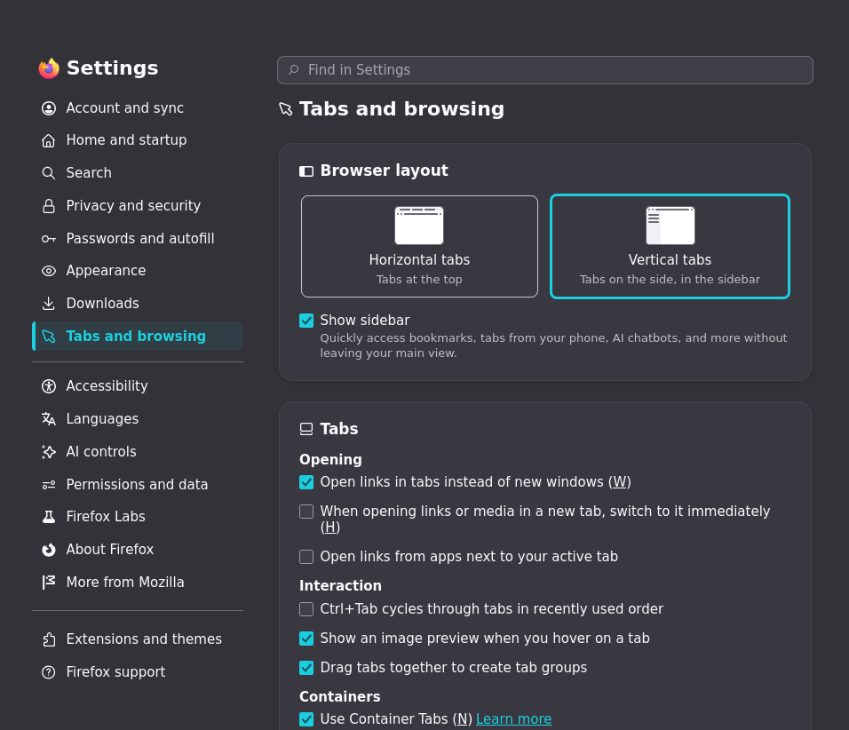

# niri creation of adam

A minimal black-and-white [niri](https://github.com/YaLTeR/niri) rice — thin white focus ring, no borders, soft shadows, and a matching Alacritty + fastfetch theme.

## Screenshots

| | |
|---|---|
|  |  |

## What's inside

```
.
├── niri/config.kdl         niri window rules, gaps, focus ring, wallpaper
├── alacritty/alacritty.toml terminal colors + opacity
├── fastfetch/config.jsonc   fastfetch module list + white/gray color scheme
├── areofyl-fetch/config     alternative fetch tool config (fields, 3D logo spin)
└── screenshots/             previews
```

## Install

Copy the config you want into its usual place:

| Tool | Where it goes |
|---|---|
| niri | `~/.config/niri/config.kdl` |
| Alacritty | `~/.config/alacritty/alacritty.toml` |
| fastfetch | `~/.config/fastfetch/config.jsonc` |
| areofyl-fetch | `~/.config/areofyl-fetch/config` |

Don't forget to change the wallpaper path in `niri/config.kdl` to point at your own image, and set `spawn-at-startup "swaybg"` up if you don't already have a wallpaper daemon running.

## Bonus terminal eye-candy

A couple of extra commands that fit the vibe of this setup:

```bash
tty-clock -c -C 7   # centered clock
cmatrix -C white     # matrix rain, white on black
```

Also check out **[ertdfgcvb.xyz](https://ertdfgcvb.xyz/)** — a cool ASCII-art site, same kind of aesthetic as this rice.

## Notes

This is a personal setup shared as-is — tweak colors, gaps, and opacity to taste.
